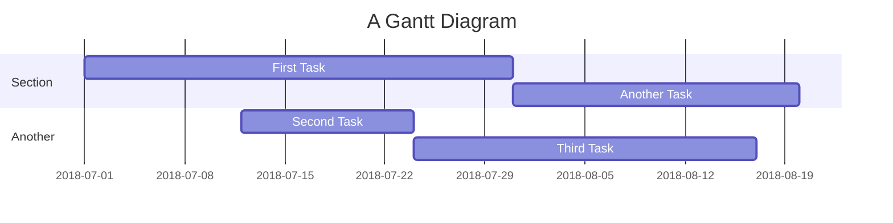

# BETA TESTING

### COSA CONTROLLARE: 

1. ECCEZIONI del try-catch: prova bene tutte le eccezioni possibili
2. BUG: controllare un problema x 
3. Miglioramenti

### USER EXPERIENCE:
- Hai suggerimenti per migliorare l'esperienza dell'utente su questo gioco? 
- Come valuti l'usabilità e la chiarezza del gioco?

## POST BETA TEST

    
 Raccolta Feedback 

   
    
 Feedback di Fabio 

### RACCOLTA DEI FEEDBACK DI FABIO:

**ECCEZIONI**
- ECCEZIONE TRY-CATCH: L'inserimento iniziale dei numeri è corretto, mi piace il "non hai inserito un numero" dopo che si inserisce una lettera! Peccato però che alla richiesta di inserire un nuovo numero, se scrivo nuovamente una lettera mi dà l'errore "System.FormatException",
magari potresti provare ad inserire pure un try/catch alla seconda stringa di risposta. 

**BUG**
- BUG PUNTEGGIO: Ho notato anche che nonostante finisca i punti continui a contarli sotto lo 0 e non si ferma (ad esempio in questo caso se finisco il punteggio a -1, non 0),
credo che mettendo "punteggio <= 0" alla fine questo problema si sistemi

- BUG TENTETIVI: Se ho capito bene vuoi che si fermi il gioco anche dopo 10 tentativi, ho provato 12 volte ma mi fa ancora andare avanti

- BUG SORTEGGIO: Molto particolare anche il fatto che, quando mi chiede "s" per il suggerimento, anche se scrivo "pinguino" me lo dà comunque buono. 
 
Se sistemi queste piccole cose secondo me questo giochino è un bel passatempo!

### PRIORITA'
- [X] BUG PUNTEGGIO
- [X] BUG TENTATIVI
- [X] ECCEZIONE TRY CATCH INSERIMENTO LETTERE AL POSTO DEI NUMERI
- [X] BUG SUGGERIMENTO

## GRAFICI GIANT 

