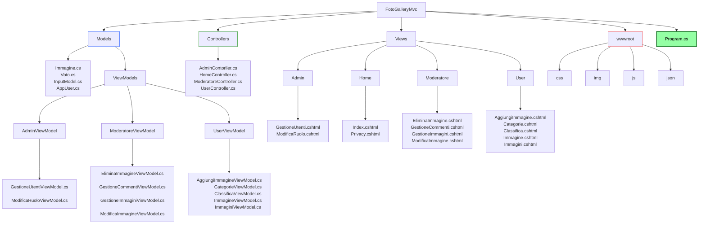
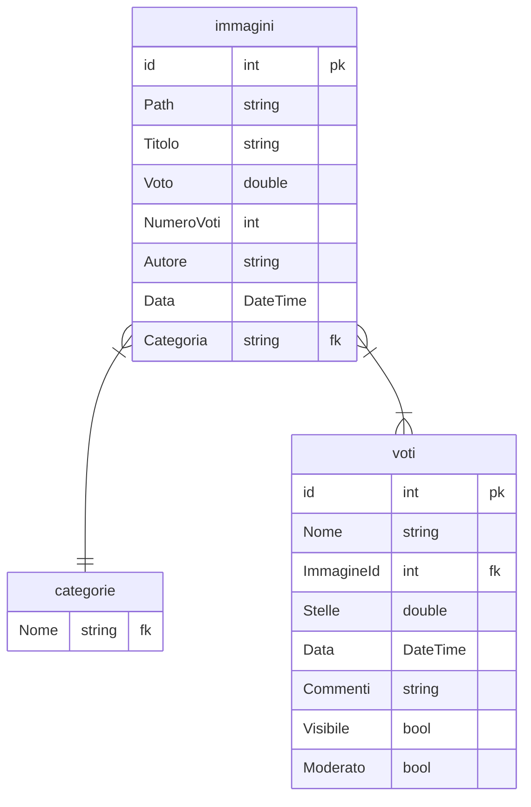

# FOTOGALLERYMVC

Applicazione mvc per la creazione di un sito web di tipo photogallery con la possibilità di registrarsi e accedere alla sezione dedicata in base al ruolo dell'utente registrato. Esistono tre tipi di ruoli:

### Utente: 
ha la possibilità di aggiungere immagini da inserire all'interno del sito, visualizzare le immagini degli altri utenti, votarle da 1 a 5 stelle e commentarle (i commenti verranno moderati dal moderatore). Dunque l'utente può accedere alle seguenti sezioni:

- Home: in cui l'utente può visualizzare le immagini del sito disposte su griglia con media voto e icona stella. Cliccando su un immagine è possibile accedere al dettaglio dell'immagine selezionata e avere la possibilità di votarla e commentarla.
Nella Home è presente anche il tastino Aggiungi che permette all'utente di aggiungere le immagini al sito (inserendo Il titolo, l'autore, la categoria dell'immagine e il link in formato .jpg dell'immagine).

- Categorie: tramite la seguente sezione è possibile filtrare le immagini in base alla categoria selezionata 

- Classifica: la classifica delle immagini in forma tabellare ordinabili in base alla media dei voti. (o dalla più votata o dalla meno votata)

### Moderatore: 
il moderatore, oltre a poter accedere alle funzionalità dell'utente, può gestire le immagini e i commenti lasciati dagli utenti. Può accedere alle seguenti sezioni aggiuntive: 

- Gestione Immagini: il moderatore può modificare ed eliminare le immagini. 

- Gestione Commenti: il moderatore può censurare o approvare i commenti lasciati dagli utenti

### Admin:

l'Admin è la figura che ha la possibilità di accedere a tutte le pagine del sito e al compito aggiuntivo di gestire gli utenti o eliminandoli oppure modificandone il ruolo. Può accedere alla seguente sezione aggiuntiva:

- Gestione Utenti: l'admin può visualizzare tutti gli utenti registrati al sito con i loro rispettivi dati (id, nome, cognome, email e ruolo). Tramite questa sezione ha la possibilità di eliminare o modificare il ruolo degli utenti

## PUBBLICO TARGET  
- L'applicazione è pensata per tutti.  

## DEFINIZIONE DEI REQUISITI E ANALISI  
- [x] L'applicazione permette all'utente di inserire voto e commento una sola volta per ogni immagine. 
- [x] L'applicazione permette all'utente di aggiungere un'immagine inserendo titolo, autore, categoria e link.
- [x] L'applicazione permette al moderatore di moderare i commenti, censurandoli o approvandoli.
- [x] L'applicazione permette al moderatore di gestire le immagini, modificandole oppure eliminandole.
- [x] L'applicazione permette all'utente di visualizzare tutte le immagini disposte in griglia.
- [x] L'applicazione permette all'utente di visualizzare ogni singola immagine con i dettagli.
- [x] L'applicazione permette all'utente di visualizzare la classifica delle immagini. 
- [x] L'applicazione permette all'admin di gestire gli utenti, con la funzione di eliminare gli utenti o modificare il loro ruolo

## PIANIFICAZIONE E DESIGN DELL'ARCHITETTURA  

>
> Struttura dell progetto :

- [x] L'applicazione utilizza file json per la memorizzazione dei dati:
> - immagini.json
> - voti.json
> - categorie.json

> Struttura relazionale dei file json:

Il file **immagini** conterrà:
- Id: numero identificativo univoco dell'immagine
- Path: percorso dell'immagine
- Titolo: breve descrizione dell'immagine
- Voto: media dei voti utenti
- Autore: chi ha pubblicato
- Data: data di pubblicazione immagine
- Categoria: categoria di appartenenza dell'imamgine

Il file **voti** conterrà:
- Id: numero identificativo univoco dell'utente
- Nome: il nome dell'utente
- ImmagineId: numero identificativo univoco dell'immagine
- Stelle: voto da 1 a 5
- Data: data di pubblicazione del commento
- Commento: breve commento dell'utente
- Visibile: valore booleano gestito dal moderatore che setta il commento su visibile o nascosto
- Moderato: valore booleano gestito dal moderatore che setta il commento come processato 

Il file **categorie** conterrà le seguenti 6 categorie (con possibilità di aggiunte future):
> - Paesaggi
> - Sport
> - Cibo
> - Persone
> - Oggetti
> - Animali

## DEFINIZIONE DI STRUTTURE E CONVENZIONI

- [x] I nomi dei **namespace** devono essere PascalCase.
- [x] I nomi delle **classi** devono essere PascalCase.
- [x] I nomi dei **metodi** devono essere PascalCase.
- [x] I nomi delle **variabili** devono essere camelCase.
- [x] I nomi delle **costanti** devono essere SNAKE_UPPERCASE.
- [x] I nomi dei **file** devono essere camelCase.
- [x] I nomi delle **cartelle** MVC e Data devono essere PascalCase.
- [x] I nomi dei file **immagini** devono essere snake_case.
- [ ] I nomi dello **schema** sql devono essere snake_case.

## SVILUPPO DEI COMPONENTI

- [ ] Creare un progetto applicazione console.
- [x] Creare un progetto applicazione web.
- [ ] Creare un progetto di test per i test unitari.

## TEST E DEBUGGING

- [ ] Scrivere test unitari per i componenti dell'applicazione.
- [ ] Eseguire il debugging per individuare e risolvere i bug.

## DOCUMENTAZIONE

- [x] Documentare il codice e l'architettura dell'applicazione.
- [ ] Documentare i test unitari.
- [ ] Documentare la fase di Beta Testing.
- [ ] Documentare la fase di post Beta Testing.