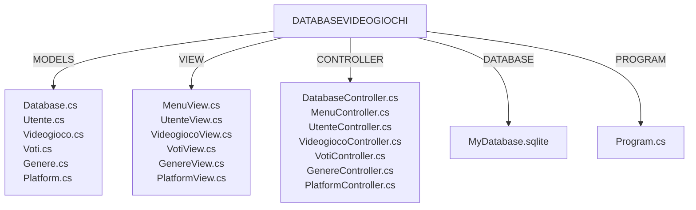
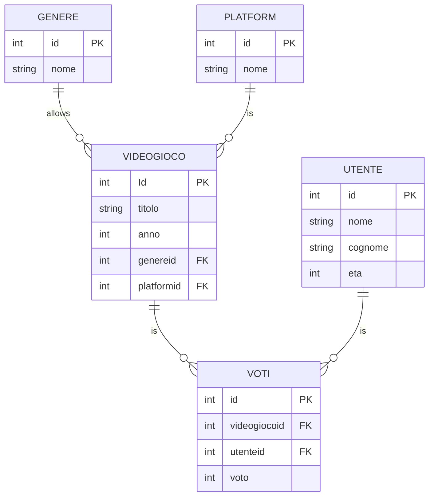

# DATABASE VIDEOGIOCO:
Applicazione che permette l'inserimento di videogiochi con le relative informazioni (titolo, anno di uscita, genere e platform), l'inserimento degli utenti e l'inserimento dei voti che gli utenti assegnano ad un videogioco.

## DEFINIZIONE DEI REQUISITI E ANALISI:
- [x] L'applicazione permette di inserire il titolo, l'anno di uscita, il genere e la console di un videogioco.
- [x] L'applicazione permette di inserire il nome, il cognome e l'età di un utente.
- [x] L'applicazione permette di inserire il voto, l'utente che ha inserito il voto, il videogioco a cui l'utente ha assegnato il voto e il voto.
- [x] L'applicazione permette di visualizzare tutti i dati delle tabelle. 
- [x] L'applicazione permette di aggiornare i dati relativi ad ogni tabella
- [x] L'apllicazione permette di rimuovere i dati inseriti in ogni tabella.

## DEFINIZIONE DI STRUTTURE E CONVENZIONI
- [x] I nomi delle classi devono essere PascalCase.
- [x] I nomi dei metodi devono essere PascalCase.
- [x] I nomi delle variabili devono essere camelCase.
- [x] I nomi delle costanti devono essere UPPERCASE.
- [x] I nomi dei file devono essere lowercase.
- [x] I nomi dei progetti devono essere PascalCase.
- [x] I nomi dei namespace devono essere PascalCase.

### DOCUMENTAZIONE
- [X] Documenta il codice e l'architettura.

## STRUTTURA DEL PROGRAMMA: 
- [x] CARTELLA MODELS: gestisce la creazione del database e i dati relativi alle varie tabelle presenti in esso.
- [x] CARTELLA VIEW: gestisce l'interfaccia utente. 
- [x] CARTELLA CONTROLLER: gestisce le interazioni dell'utente tramite l'input ricevuto ed è quindi responsbile della selezione dei tipi di modello con cui interagire. In sostanza, controlla il modo in cui l'app risponde ad una determinata richiesta e di conseguenza inserisce i dati ricevuti dall'utente nel database.
- [x] DATABASE: rappresenta il database vero e proprio con le tabelle
- [x] PROGRAM: rappresenta l'entry point dell'applicazione, in sostanza configura e avvia l'applicazione istanziando i controller e le view necessarie

## DATABASE:

## Interfaccia utente:
### MENU PRINIPALE: 
ti fa accedere alle seguenti opzioni:
- [x] menù utente
- [x] menu videogioco
- [x] menu voti
- [x] menu genere
- [x] menu platform

### MENU UTENTE: 
ti fa accedere alle seguenti opzioni:
- [x] Aggiungi un utente
- - [x] inserisci nome, cognome ed eta
- [x] visualizza tutti gli utenti
- [x] modifica un utente
- - [x] modifica il nome 
- - [x] modifica il cognome
- - [x] modifica l'età
- [x] rimuovi un utente
- - [x] quale utente vuoi elimare?

### MENU VIDEOGIOCO: 
ti fa accedere alle seguenti opzioni:
- [x] Aggiungi un videogioco
- - [x] inserisci titolo, anno di uscita, id genere, id console
- [x] visualizza tutti i videogiochi
- [x] modifica un videogioco
- - [x] modifica il titolo
- - [x] modifica l'anno di uscita
- - [x] modifica l'id genere
- - [x] modifica l'id platform
- [x] rimuovi un videogioco
- - [x] quale videogioco vuoi eliminare?

### MENU VOTI:
- [x] aggiungi un voto
- - [x] inserisci l'id del videogioco a cui assegnare il voto, inserisci l'id dell'utente che ha assegnato il voto, inserisci

